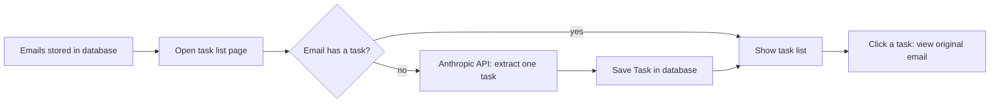

# School Mail Task Manager

> A Django web application that uses the Anthropic API to intelligently parse school emails and present them as clear, actionable tasks.

---

# Poke

**Turns school emails into a clear to-do list for parents.**

> **Status: work in progress (MVP).** The backend and a basic web interface work end to end. The Android app has not been started. See [Project status](#project-status).

## The problem

Schools send many emails: trip forms, payment deadlines, non-uniform days, parents' evenings. The one thing a parent needs to do is easy to miss in the text. Poke reads each email and shows a short, actionable task, with the original email one click away so the parent can always check it.

## Project status

| Component | Status |
|---|---|
| Django backend (models, Anthropic integration) | Done (MVP) |
| Web UI (Django templates) | Done (basic) |
| UI design (Figma) | Done |
| REST API (JSON) | Planned |
| Android app (React Native) | Planned, I am learning React |
| Automated tests | TODO: describe what `tasks/tests.py` currently covers |
| Authentication | Not implemented |
| Email ingestion from a mailbox | Out of scope by design (see below) |

## How it works



1. Emails are stored in the `Email` table (sender, subject, message, created_at).
2. When the task list page is opened, every email without a task is sent to the Anthropic API (model `claude-haiku-4-5-20251001`) with a prompt asking for one task of at most 40 characters.
3. The result is saved as a `Task`, linked one-to-one to its email.
4. The task list shows each task. Clicking one opens the full original email, so the user can verify the summary.


<!-- TODO: add screenshots of the web UI and Figma designs to /docs and link them here -->

## Design decisions

- **No mailbox connection (intentional).** These are emails about a child, so the app does not connect to Gmail or any inbox in v1. Emails are loaded into the database manually. Future options, each needing its own security review: a dedicated forwarding address, importing `.eml` files, or read-only OAuth with minimal scope.
- **One task per email.** A deliberate MVP simplification, enforced by a `OneToOneField`. See limitations.
- **Haiku model.** A small, fast, low-cost model is enough for short extraction.
- **Show the source email next to every task.** AI output can be wrong, so the user can always check it.

## Tech stack

Python, Django, SQLite (development), Anthropic Python SDK, Django templates.
Planned: Django REST Framework, React Native (Expo).

## Setup

```bash
git clone <repo-url>
cd poke
python -m venv venv
source venv/bin/activate        # Windows: venv\Scripts\activate
pip install -r requirements.txt
cp .env.example .env            # then add your own ANTHROPIC_API_KEY
python manage.py migrate
python manage.py createsuperuser
python manage.py runserver
```

Add some sample emails through the Django admin at `/admin/`, then open the task list page (see `tasks/urls.py` for the route).

**Never commit `.env`, API keys or real emails.** They are listed in `.gitignore`.

## User stories

1. As a parent, I want a school email to be reduced to actionable tasks. Ideally one per email but more if needed. I need to see what to do at a glance.
2. As a parent, I want to open the original email from a task, so I can check the details myself.
3. As a parent, I want deadlines and payment amounts shown on the task, so I don't miss them. *(planned)*
4. As a parent, I want to mark tasks as done, so my list only shows what is left. *(planned)*
5. As a parent, I want to use the app on my Android phone, so I can check tasks on the go. *(planned)*
6. As a parent, I want emails with no action to be marked "no action needed", so my list isn't cluttered. *(planned)*
7. As a parent , I want to log in to my account. *(planned)*

## Testing

- **Current state:** TODO: describe honestly what `tasks/tests.py` contains (for example "basic model tests" or "placeholder, no tests yet").
- **Planned:**
  - A fixture set of 10 to 15 synthetic emails with expected tasks, covering: no action, several actions, ambiguous dates ("next Friday"), forwarded chains, payment requests, very long emails.
  - Unit tests that **mock** the Anthropic API, so they are fast, free and deterministic.
  - A small separate set of live checks against the real API, comparing output to expected tasks.
  - Failure cases: API timeout, rate limit, empty or over-long response.

## Known limitations

1. **One task per email.** An email with three actions produces one task, and an email with no action is still forced to produce one.
2. **Task creation happens on page load.** Opening the task list triggers one API call per new email. This is slow with many emails and costs money.
3. **No error handling around the API call.** If a call fails, the page returns an error. The fix is to catch API errors and use a timeout.
4. **The 40-character limit is only requested in the prompt, not enforced.**
5. **No authentication.** Anyone who can reach the server can see the tasks and emails. This must be fixed before any deployment.
6. **Prompt injection.** Email text is inserted directly into the prompt, so a malicious email could try to influence the output.
7. **Model output can be wrong**, for example misreading a date. Users should always check the source email.
8. **Dates and deadlines are not extracted as structured data yet.**

## Privacy and security

- Email content is personal data relating to a child, so real emails are not committed to this repository. Use synthetic samples.
- For each email, the sender, subject and message are sent to the Anthropic API. Planned: remove the sender (not needed for the task) and redact names, phone numbers and addresses before sending.
- The API key is read from an environment variable and is never committed.
- Before any real-world use, I will review Anthropic's current API data retention and usage terms (link here) and my UK GDPR obligations.
- Authentication and HTTPS are required before the app is deployed or used from a phone.

## Roadmap
 
Each phase produces something that can be demonstrated. Time estimates assume 1 to 2 hours a day.
 
**Phase 1: Make it safe and solid (days 1-5)**
- Rename the project and tidy the repository (remove unused placeholder files)
- Error handling and timeouts on the Anthropic API call
- Move the API call into `utils/anthropic_parser.py`
- Remove the sender from the prompt (send the minimum data needed)
- Move task creation off the page load and into a management command, so visitors cannot trigger paid API calls
- Synthetic fixture emails covering edge cases, with tests that mock the Anthropic API
- Mobile-friendly templates (base template, viewport tag, simple CSS)
- Demo login or read-only demo mode
**Phase 2: Live web demo (days 6-8)**
- Production settings (`DEBUG=False`, secret key and allowed hosts from environment variables, static files)
- Deploy to a hosting provider with synthetic data only, and set an API spending limit
- Add the live link, screenshots and a short screen recording to this README
**Phase 3: Learn React (days 9-10 and ongoing)**
- Core React concepts (components, props, state, hooks)
**Phase 4: Android app (approx. weeks 3-12)**
- REST API with Django REST Framework, token authentication and generated API docs
- Expo (React Native) project: first screen lists tasks from the hosted API
- Task detail screen showing the source email
- Apply the Figma design
- Test on real Android devices, then closed testing and release on Google Play (check current Google Play requirements for new developer accounts)
**Later**
- Multiple tasks per email, deadlines, task completion
- Safe email ingestion (forwarding address or `.eml` import), each option with its own security review
## Licence
 
TODO: choose a licence or state "All rights reserved".
 
